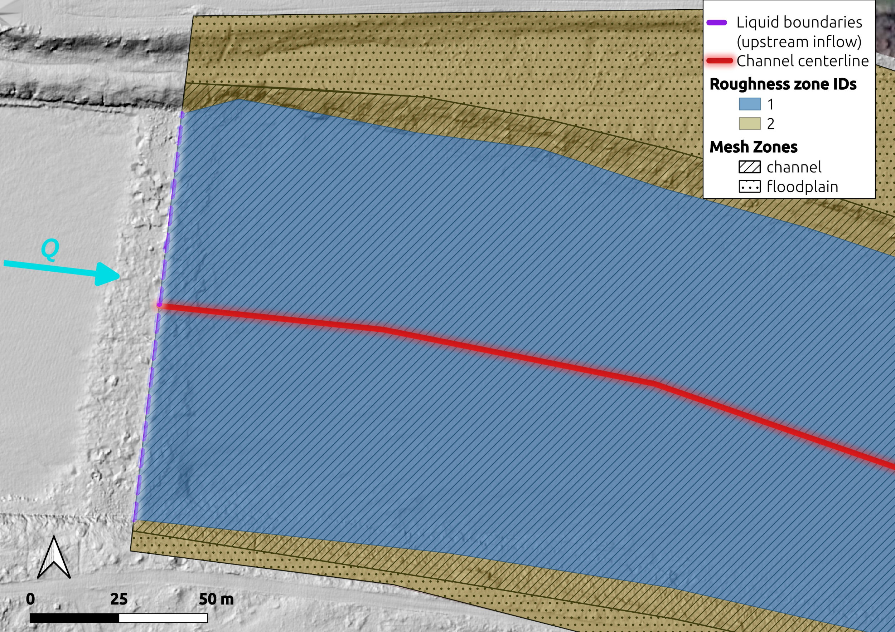

Input Files
===========

``hydromate`` is driven by a single YAML **configuration file** that points, by
path, at the input data. There are three kinds of input:

#. **Geodata** - the rasters and vector layers describing the terrain, the model
   boundaries, the mesh/friction zones and the measurement positions;
#. the **simulation config** - the YAML itself (optionally edited in the graphical
   configurator);
#. **ground truth** - the field measurements that become calibration / validation
   targets.

All paths in the config are resolved **relative to the configuration file's own
directory**. Every vector/raster layer may be in any coordinate system: it is
**reprojected to the project CRS** (``project.crs_epsg``, metres) on ingest. Keep
raw inputs immutable - produced artifacts are written under ``hydromate-case/``.

.. _input-geodata:

Geodata
-------

A typical anisotropic-mesh build needs, at minimum, an initial **DEM** plus four
hand-digitised **vector layers** - the ROI polygon (``roi-<reach>.gpkg``), the
liquid boundaries (``liquid-boundaries.gpkg``), the mesh zones
(``mesh-zones.gpkg``) and the channel centerline (``channel-centerline.gpkg``) -
and, for zonal friction, a fifth (``roughness-zones.gpkg`` + its
``roughness-table.csv``). The filenames are only a convention (any name works; the
config points at them by path); what matters is the **geometry type** and the
**attribute fields** listed below.

Required user files (summary)
~~~~~~~~~~~~~~~~~~~~~~~~~~~~~~~~~~

Field names are matched **case-insensitively**; vector layers may be GeoPackage
(``.gpkg``), Shapefile (``.shp``) or anything GDAL/OGR reads, in any CRS
(reprojected on ingest). ``--`` in the *Attribute fields* column means the layer's
attribute table is not read (only its geometry).

.. list-table::
   :header-rows: 1
   :widths: 20 18 12 22 28

   * - Config key
     - Example file
     - Geometry
     - Attribute fields
     - Notes
   * - ``geodata.dem_initial`` *(required)*
     - ``dem-2020.tif``
     - raster
     - --
     - baseline terrain (GeoTIFF), any resolution/CRS.
   * - ``geodata.dem_target`` *(optional)*
     - ``dem-2025.tif``
     - raster
     - --
     - a second-epoch DEM; enables the :ref:`DEM-of-Difference <input-config>` and
       the morphodynamic path.
   * - ``geodata.boundary`` *(required)*
     - ``roi.gpkg``
     - **polygon**
     - --
     - the ROI / maximum-wetted-extent - **one closed polygon** (a single feature).
       Everything is clipped to it.
   * - ``boundaries.liquid_boundaries`` *(required for a build)*
     - ``liquid-boundaries.gpkg``
     - **line(s)**
     - a *type* field, values ``inflow`` / ``outflow``
     - one line feature per inflow and per outflow cross-section (several of each allowed). The field name must be ``Type (inflow/outflow)`` though any column whose name mentions *type / kind / inflow / outflow / stringdef*; each cell **value must** contain ``inflow`` or ``outflow``. The lines MUST coincide with the outer bounds of the mesh zones so the contour nodes fall on them.
   * - ``geodata.mesh_zones`` *(optional)*
     - ``mesh-zones.gpkg``
     - **polygons**
     - ``Zone Name`` (text) + ``Max Edge Length (m)`` (double)
     - one polygon per zone tiling the ROI. ``Zone Name`` must be either ``channel`` / ``floodplain`` / ``refinement``; the ``Max Edge Length (m)`` field (decimal point **or** German comma accepted) is that zone's target edge length (that is, mesh resolution) and drives the anisotropic mesh (see :ref:`Meshing <meshing>`).
   * - ``geodata.channel_centerline`` *(optional)*
     - ``channel-centerline.gpkg``
     - **line**
     - --
     - a single line down the channel thalweg; the channel cells are elongated along it. Also used for the pre-wetting cross-sections and, for a :ref:`gain-lose reach <usage-gain-lose>`, to find the two ends of the porous body's reach extent. Using a hillshade is recommended for this purpose (see below image)
   * - ``geodata.roughness_zones`` *(optional)*
     - ``roughness-zones.gpkg``
     - **polygons**
     - ``Zone ID`` (integer)
     - one polygon per friction zone; each polygon's integer ``Zone ID`` becomes the per-node ``FRIC_ID`` and is paired with ``geodata.roughness_table`` (e.g.
       zone ``1`` = channel, ``2`` = floodplain).
   * - ``geodata.structures`` *(optional)*
     - ``structures.gpkg``
     - **polygons** or **lines**
     - ``Type``, ``Crest (m)`` or ``Height (m)``, ``Width (m)`` (lines), optional ``Mode``, ``Name``
     - dams, weirs, walls and buildings. A **polygon** is the footprint directly;
       a **line** is buffered by ``Width (m)`` - the natural way to draw a wall or a
       dam crest. ``Crest (m)`` gives a *level* crest (dam, weir, floodwall),
       ``Height (m)`` a crest that *follows the terrain* (embankment, levee). The
       ``Type`` text selects the mode by substring - ``dam``/``weir``/``levee`` are
       **overflow** (the bed is raised to the crest), ``wall``/``building``/``pier``
       are **solid** (OpenFOAM removes the footprint; TELEMAC raises the bed to
       crest + ``solid_freeboard_2d``) - and a ``Mode`` column overrides it per
       feature. **No STL is needed**: that is a ``snappyHexMesh`` requirement, and
       hydromate writes its mesh itself. See :ref:`usage-structures`.
   * - ``geodata.control_sections`` *(optional)*
     - ``cross-sections.gpkg``
     - **lines**
     - a name field (``control_section_name_field``)
     - cross-sections at which the discharge is integrated **from the result** after
       a run, into ``baffle-XS-q.csv`` (one row per line). Because it reads the
       result rather than the steering file, the lines can be drawn and moved in GIS
       without re-running the solver - which is how the split of the total discharge
       between the threads of a braided reach is read off and checked against field
       transects.
   * - ``gain_lose.zone`` *(optional)*
     - ``porous-body.gpkg``
     - **polygon(s)**
     - ``Patch name``, ``porous depth (m)``
     - the porous body of a :ref:`gain-lose reach <usage-gain-lose>` (a gravel bar,
       an alluvial patch). With the default ``faces: water-table`` this is the
       **only** geometry needed - the exchange faces follow from the body's water
       table, so nothing has to be drawn where percolation is thought to begin and
       end. Needs ``geodata.channel_centerline``.
   * - ``geodata.breaklines`` *(optional)*
     - ``breaklines.shp``
     - **lines**
     - --
     - internal constraint lines for the isotropic-fallback mesh.

The vector layers must **line up**: the liquid-boundary lines span the inflow / outflow cross-sections and coincide with the outer bounds of the mesh zones, the mesh-zone polygons tile the ROI (and share those edges), and the centerline runs down the channel. See :ref:`Drawing the vector layers <digitising-geodata>` below.

Tabular geodata (CSV):

``boundaries.inflow`` *(optional; e.g.* ``inflow.csv`` *)*
    upstream discharge. **Optional** - the steady initial run uses the scalar ``boundaries.prescribed_flowrate``; an inflow series is only needed for a later unsteady (varying-hydrograph) run. Either a **generic CSV** with a discharge column (``value`` / ``q`` / ``discharge`` / ``flow``), or the Bavarian-LfU export format (``;`` separator, ``,`` decimal, metadata header, ``datetime;value`` rows).
``geodata.roughness_table`` *(optional; e.g.* ``roughness-table.csv`` *)*
    CSV ``zone_id,ks`` mapping each ``roughness-zones.gpkg`` ``Zone ID`` to a
    roughness value (e.g. a Nikuradse :math:`k_s` in metres); one row per zone.
``boundaries.stage_discharge`` *(optional; e.g.* ``rating-curve.csv`` *)*
    the outlet rating curve as a ``Q,WSE`` CSV (discharge [m³/s], water-surface elevation [m]); extra rows are interpolated. One pair at the steady discharge suffices. Only used when ``outflow_condition: stage_discharge``; auto-synthesised from a Manning/Strickler value + channel geometry by ``hydromate rating`` (or ``preprocessing.py``) when absent.

Measurement **positions** (point layers joined to the ground-truth value files or the :ref:`calibration-target template <input-target-template>` by ``ID`` / row order) also live in geodata and are reprojected on ingest; see :ref:`Ground truth <input-ground-truth>`.

.. _digitising-geodata:

Drawing user vector layers (QGIS)
~~~~~~~~~~~~~~~~~~~~~~~~~~~~~~~~~~

The mesh zones (``mesh-zones.gpkg``), roughness zones (``roughness-zones.gpkg``), liquid boundaries (``liquid-boundaries.gpkg``) and channel centerline (``channel-centerline.gpkg``) are digitised by hand in a GIS, over the ROI polygon (``roi-<reach>.gpkg``). They must line up: the liquid-boundary lines span the inflow / outflow cross-sections and coincide with the outer bounds of the mesh zones, and the centerline runs down the channel. Give each layer the **attribute fields** listed in the table above (``Zone Name`` + ``Max Edge Length (m)`` on the
mesh zones, ``Zone ID`` on the roughness zones, the ``inflow`` / ``outflow`` *type* field on the liquid boundaries).

**Structures** (``structures.gpkg``) are digitised the same way and need nothing
special: no 3D geometry, no STL, no CAD. Trace a dam crest or a wall as a **line** and
give it a ``Width (m)``, or digitise a building as a **polygon**; then type in a
``Crest (m)`` (a level crest) or a ``Height (m)`` (above the local ground). QGIS's 3D
map view will even extrude the footprints by the height attribute for a visual check,
but hydromate reads only the geometry and the attributes.

   The inlet of the Inn model: the mesh-zone and roughness-zone polygons, the
   liquid-boundary line and the channel centerline drawn over a **hillshade** of
   the DEM. The liquid-boundary line spans the inflow cross-section, the zone
   polygons meet along it, and the centerline runs down the channel.

.. tip:: Hillshade background for digitising

   A **hillshade raster** brings out the channel banks, bars and structures, which
   makes tracing the **channel centerline** (and digitising the mesh / roughness
   zones and liquid boundaries) far easier. Create one from the DEM in QGIS:
   *Processing Toolbox → GDAL → Raster analysis → Hillshade*, with **Azimuth 315,
   Altitude 45, Z factor 1**, then load it as the background under your vector
   layers (as in the figure above).

.. tip:: Carving ``refinement`` zones out of a larger zone (QGIS *Add Ring*)

   A local ``refinement`` polygon usually sits inside a larger ``channel`` /
   ``floodplain`` polygon. The cleanest way to nest it is to cut a matching hole
   (an interior ring) in the larger polygon so the two do not overlap:

   #. Make sure ``mesh-zones.gpkg`` is in **edit mode**.
   #. Select the large polygon (e.g. from the attribute table).
   #. Activate the **Add Ring** tool (first enable it via *View → Toolbars →
      Advanced Digitizing Toolbar*). The Add Ring tool creates an interior ring
      inside an existing polygon, i.e. it cuts a hole from that polygon; the hole
      must lie inside the polygon.
   #. Turn on **snapping / tracing** if you want to follow the boundary of the
      small (refinement) polygon exactly.
   #. Trace around the first small polygon, then **right-click** to finish the ring.
   #. Repeat for every small polygon, then **save edits**.

   Each refinement polygon itself carries a ``Zone Name`` containing ``refinement``
   and its own ``Max Edge Length (m)``.

.. _input-config:

Simulation config
-----------------

The configuration is a single YAML file with these top-level sections:

``project``
    case ``name``, ``crs_epsg`` (project coordinate system, metric), and the
    per-phase output directories under ``hydromate-case/`` (``preprocessing_dir``,
    ``model_dir``, ``postprocessing_dir``, ``calibration_dir``).
``telemac``
    ``pysource`` (the TELEMAC environment script, *sourced* - not imported -
    whenever the solver/SELAFIN tooling is needed), ``solver`` and ``n_processors``
    (the default MPI core count; ``initial_run.py``'s module-level ``NCSIZE`` can
    override it for that one test run).
``geodata``
    the :ref:`Geodata <input-geodata>` file paths (DEM(s), ROI boundary, mesh/
    roughness zones, centerline, breaklines, region/MATID points).
``boundaries``
    the boundary conditions: ``liquid_boundaries`` (the inflow/outflow line layer),
    the steady inflow discharge (``prescribed_flowrate``, m3/s), the outflow-boundary
    type (``outflow_condition``: ``elevation`` (default) / ``stage_discharge`` /
    ``free``) with its prescribed value (``prescribed_elevation`` or the
    ``stage_discharge`` rating curve), and the optional ``inflow`` series (for a
    later unsteady case).
``initialization``
    the initial condition: the dry-start plug (``dry_start_depth`` /
    ``dry_start_extent``) or the ``prewet_depth`` hotstart.
``mesh``
    the per-zone (channel / floodplain / refinement) fallback edge lengths,
    ``growth_ratio`` and ``channel_anisotropy`` (see :ref:`Meshing <meshing>`), or
    the isotropic fallback's ``default_size`` / ``breakline_size`` / ``region_sizes``.
``friction``
    the default friction law/coefficient and one zone per MATID (when the MATID
    scheme is used).
``hydrodynamics``
    steady/unsteady regime, time stepping and the **numerics** (finite volumes vs
    finite elements, turbulence). The finite-element numerics ship **compute-stable
    defaults** (see :ref:`Numerics <numerics>`).
``morphodynamics`` *(optional)*
    enable **GAIA** and declare the sediment classes and bed-process capacities. The
    two transport switches ``bedload`` / ``suspended_load`` are joined by the
    morphodynamic knobs a real river run needs, each a verified GAIA keyword:
    ``morphological_factor`` (accelerate bed evolution over a hydrograph),
    ``slope_effect`` / ``slope_formula`` / ``friction_angle`` (transverse bed-slope
    pull on bedload), ``secondary_currents`` (+ ``secondary_currents_alpha``, the
    spiral-flow deviation in bends), ``bed_layers`` / ``active_layer_thickness`` (bed
    stratigraphy) and ``prescribed_solid_discharges`` (a sediment supply per liquid
    boundary). GAIA is coupled to **every** hydrodynamic run that can carry it - the
    steady case and, most usefully, the hydrograph-driven ``unsteady2d.cas`` and its
    3D twin ``unsteady3d.cas`` (see :ref:`Morphodynamics <morphodynamics>`).
``dem_of_difference`` *(optional)*
    compute the DoD (``dem_target - dem_initial``) in pre-processing, clipped to the
    ROI and thresholded by a minimum **level of detection** - either an explicit
    ``min_lod`` or the propagated survey uncertainty
    ``t * sqrt(uncertainty_initial^2 + uncertainty_target^2)`` (``t`` from
    ``confidence_level``); sub-LoD change is masked to nodata or set to 0
    (``mask_below_lod``).
``ground_truth``
    the calibration ground truth: the :ref:`calibration-target template
    <input-target-template>` (``targets``), a tidy ``measurements`` table, or the
    raw ``sources`` hydromate compiles into it.
``calibration``
    the calibration and extraction quantities, the calibration parameters with
    their ranges, and the sampling settings forwarded to HydroBayesCal.

A minimal example:

.. code-block:: yaml

   project:
     name: inn
     crs_epsg: 25832
   telemac:
     pysource: /home/user/opt/telemac/configs/pysource.gfortran.sh
     solver: telemac2d
     n_processors: 4
   geodata:
     dem_initial: ../geodata/dem.tif
     boundary: ../geodata/roi.gpkg
   boundaries:
     liquid_boundaries: ../geodata/liquid-boundaries.gpkg
     prescribed_flowrate: 47.2   # inflow Q [m3/s] for steady2d.cas (this case's discharge)
     outflow_condition: elevation  # downstream stage (H); the default
     prescribed_elevation: 379.5  # fixed downstream WSE [m a.s.l.]
     # inflow: ../data/inflow.csv  # OPTIONAL discharge series (for a later unsteady case)
   initialization:
     # the initial run is a dry start (only a thin plug at the inflow is wetted);
     # set prewet_depth to hotstart the whole channel instead.
   hydrodynamics:
     regime: steady              # initial run is always steady (convergence judged by flux balance)
     finite_volumes: false       # finite elements (default); true -> HLLC finite volumes
     turbulence_model: auto      # auto-picks k-epsilon / Smagorinski / Spalart-Allmaras
   calibration:
     calibration_quantities: ["WATER DEPTH"]
     parameters:
       - { name: zone1, min: 0.05, max: 0.50 }

The full, commented reference is ``cases/case-template/case-config.yml`` (copy the
whole ``cases/case-template/`` folder to start a new case).

Calibration parameter naming
~~~~~~~~~~~~~~~~~~~~~~~~~~~~~~

Parameter names follow HydroBayesCal's prefix convention:

==========================================  ====================================
Name                                        Target
==========================================  ====================================
``zone<N>``                                 bed-friction coefficient of zone ``N``
``gaiaCLASSES SHIELDS PARAMETERS <n>``      GAIA critical Shields, sediment ``n``
``vg_zone<N>-
``                          vegetation friction parameter
any literal TELEMAC keyword                 written straight into the ``.cas``
==========================================  ====================================

The :ref:`calibration-target template <input-target-template>`'s ``parameters``
tab produces these names for you from a drop-down catalog, so you rarely type them
by hand.

Graphical configurator
~~~~~~~~~~~~~~~~~~~~~~~~

Instead of hand-editing YAML you can fill in the configuration as a browser form
(built with Streamlit). Install the ``gui`` extra and launch it with the
``hydromate-gui`` console script:

.. code-block:: bash

   pip install -e ".[gui]"
   hydromate-gui                      # opens a local app in your browser
   # hydromate-gui --server.port 8600 # extra arguments are forwarded to Streamlit

This opens a local app in your browser (nothing leaves your machine). The form has
one tab per configuration section - **Project, TELEMAC, Geodata, Boundaries, Mesh,
Friction, Hydrodynamics, Initialization, Morphodynamics, Calibration** - mirroring
the dataclass schema (the geodata paths, the ``outflow_condition`` + prescribed
values, the dry-start / hotstart initial condition, the anisotropic mesh sizes, the
finite-element / ``turbulence_model: auto`` numerics, the roughness/MATID friction,
the GAIA block with the DEM-of-Difference options), plus a **Rating curve**
calculator and a **Workflow** tab summarising the steps. Friction zones, calibration
parameters, ground-truth sources and sediment classes are edited as tables.

You can load an existing YAML, preview and download the generated YAML, save it to a
path, and run **Validate** (``--check``) or **Build** directly - the same actions as
the command line, operating on the saved file so its relative input paths resolve.
The **Build** button runs the case build (``hydromate <config>``), i.e. workflow
**step 1**; the later steps (``initial_run.py`` test run, the mesh-convergence study,
HydroBayesCal, and the optional 3D extension) are run from the per-case scripts - see
:doc:`usage`.

.. _input-ground-truth:

Ground truth
------------

Field measurements become the **calibration** (and validation) targets. They are
supplied as a **tidy, multi-tab table** (an ``.xlsx`` workbook): each tab is one
*category* (``hydraulics``, ``sediment``, …); within a tab the **first three
columns are the coordinates** ``x``, ``y``, ``z`` (in the project CRS) and every
**following column is a measured quantity** at that point. Column headers are
matched case-insensitively with common aliases (``easting`` / ``northing`` for
``x`` / ``y``, ``depth`` for ``h``, ``vx`` / ``vy`` / ``vz`` for ``u`` / ``v`` /
``w``).

For FlowTracker-style hydraulics a row carries velocity components ``u``, ``v``,
``w`` (m/s), their RMS fluctuations ``u_std``, ``v_std``, ``w_std`` (m/s), the
horizontal magnitude and its spread ``u_mag`` / ``u_mag_std``, the turbulent
kinetic energy ``tke`` (m²/s²), and the water depth ``h`` (m); a morphodynamics
row carries grain sizes ``d16`` … ``d90`` (m), the ``fine_fraction`` (<1 mm) and
the bed-change ``dz`` (m). **Not every dataset has every column** - provide only
what you measured. The calibration stage derives each requested
``calibration_quantity`` from whatever columns are present (``WATER DEPTH`` from
``h``; ``SCALAR VELOCITY`` from the components or from ``u_mag``, with its error
from ``u_mag_std`` / the propagated component errors; ``TURBULENT ENERG.`` from
``tke``; ``CUMUL BED EVOL`` from ``dz``) and falls back to the configured
``measurement_error`` fraction where no measured error exists. A quantity whose
columns are missing is reported as an error rather than silently skipped.

There are three ways to provide the table:

#. **The calibration-target template** (recommended). ``hydromate targets
   <config>`` generates a user-fillable
   ``user-sources/ground-truth/calibration-target-data.xlsx`` (plus a co-located
   ``extract_flowtracker.py`` helper). You fill it in and point
   ``ground_truth.targets`` at it - see :ref:`the template section below
   <input-target-template>`.
#. **Author the tidy table yourself** (the general case): create the ``.xlsx``
   with the structure above and point ``ground_truth.measurements`` at it.
#. **Let hydromate compile it** from raw field exports: declare the raw sources
   under ``ground_truth.sources`` and the tidy table is generated for you (written
   to ``preprocessing/ground-truth.xlsx`` unless ``ground_truth.measurements``
   sets an explicit output path). Each source names a ``category``, an adapter
   ``kind``, the ``values`` file and - when the values file has no coordinates - a
   ``positions`` point layer to join on (by ``join_key``), reprojected to the
   project CRS:

   .. code-block:: yaml

      ground_truth:
        sources:
          - { category: hydraulics, kind: flowtracker, join_key: ID,
              values: ../ground-truth/hydraulics/FlowTracker2-day1.xlsx,
              positions: ../geodata/flowtracker2/dgps-day1.shp }

   The ``flowtracker`` adapter reads a SonTek FlowTracker2 ``.ft.sum`` export and
   joins each measurement vertical (by ``ID``) to its surveyed position; the
   ``points`` adapter reads a point layer (or CSV) that already carries the quantity
   columns. Sources sharing a ``category`` are concatenated into one tab.

.. _input-target-template:

The calibration-target template
~~~~~~~~~~~~~~~~~~~~~~~~~~~~~~~~~

The template gives ground truth a **consistent, user-friendly structure** whose
rows are keyed by **unique IDs** that link to a point layer in
``user-sources/geodata/``. Generate it for a case with:

.. code-block:: bash

   hydromate targets cases/<your-case>/case-config.yml

This writes ``calibration-target-data.xlsx`` (and ``extract_flowtracker.py``) into
``user-sources/ground-truth/``. The workbook has these tabs:

``hydraulics``
    one row per measurement vertical: the velocity components ``u_x``/``u_y``/``u_z``,
    their RMS fluctuations ``u_x'``/``u_y'``/``u_z'``, the horizontal magnitude
    ``U_h`` and its spread ``U_h'`` and the ``TKE`` (all three derived by **live
    Excel formulas** - ``U_h = sqrt(u_x²+u_y²)``, ``TKE = 0.5·(u_x'²+u_y'²+u_z'²)`` -
    and recomputed on ingest when left blank), the water depth and the bottom
    elevation.
``morphodynamics``
    grain-size characteristics ``d16`` … ``d90`` [mm] and the fine-sediment fraction
    (<1 mm) per sample point; the ``dz DoD`` column is **filled automatically on
    ingest** from the :ref:`DEM-of-Difference <input-config>` at each point (leave it
    blank).
``parameters``
    the calibration parameters: a **drop-down** over a catalog of TELEMAC-2D /
    TELEMAC-3D / GAIA calibration keywords (friction zones - prefilled with each
    zone's current :math:`k_s` - critical Shields stress, minimum depth, eddy
    viscosity / diffusivity, secondary currents, GAIA transport knobs, …), a
    zone/class column, the current value, the **min/max test range** and a **tips**
    column that shows the catalog's typical range for the selected parameter. These
    rows are merged into ``calibration.parameters`` (the template wins on a name
    collision).
``parameter-catalog``
    the reference table backing the drop-down and the tips lookup.

Reference the filled file in the config, joining each tab's IDs to its own point
layer (any CRS, reprojected on ingest; explicit ``x``/``y`` in the sheet win over
the layer):

.. code-block:: yaml

   ground_truth:
     targets:
       file: ../ground-truth/calibration-target-data.xlsx
       hydraulics_positions: ../geodata/flowtracker2/dgps-points.gpkg  # point layer with 'ID'
       sediment_positions: ../geodata/sediment/samples.gpkg            # point layer with 'ID'
       join_key: ID

.. tip:: Fluctuations are the sample std-dev, not ``VxErr``

   In a FlowTracker2 export, ``VxErr`` is the **standard error of the mean**
   (the velocity's measurement uncertainty, ≈ std/√Npts), **not** the turbulent
   fluctuation. The RMS fluctuation ``u'`` is the sample **standard deviation**
   (``u std`` / ``Std Dev v'(x)`` / σ).

Filling the hydraulics tab from FlowTracker2
~~~~~~~~~~~~~~~~~~~~~~~~~~~~~~~~~~~~~~~~~~~~~~

The co-located ``extract_flowtracker.py`` script populates the ``hydraulics`` tab
straight from SonTek FlowTracker2 exports, one row per point keyed by the point's
own ID:

.. code-block:: bash

   cd cases/<your-case>/user-sources/ground-truth
   mamba run -n hydromate-env python extract_flowtracker.py FlowTracker2-day1.xlsx FlowTracker2-day2.xlsx

It auto-detects the three real export layouts - the SonTek ``.ft.sum`` summary, a
TKE-stats export, and the multi-sheet ``FT_TKE_Summary`` (raw per-sample sheets are
skipped). The velocity components come from ``VelX``/``VelY``/``VelZ``; the RMS
fluctuations from the sample standard deviation (``u std`` / ``Std Dev v'(x)`` / σ)
where present, otherwise **reconstructed** as ``u' ≈ VxErr·√Npts``; ``U_h``,
``U_h'`` and ``TKE`` recompute in the sheet (or a measured ``TKE`` is used when the
file provides one). The same logic is available programmatically as
:func:`hydromate.read_flowtracker` / :func:`hydromate.fill_template_hydraulics`.

.. note::

   The hydraulics tab needs **globally-unique IDs** to join a single position
   layer. Multi-day surveys whose files each restart IDs at 0 (e.g.
   ``FlowTracker2-day1``/``day2``) must be extracted into separate templates /
   position layers, or their IDs made unique first - otherwise the ID join reports
   a duplicate-ID error.
